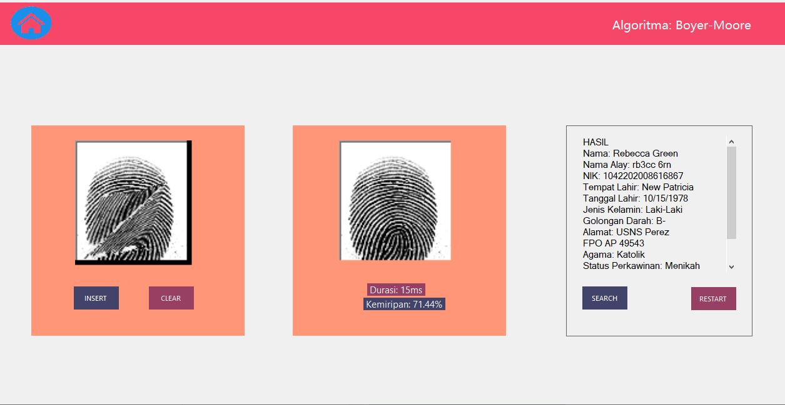

# Tubes3_Barbarians
> Pemanfaatan Pattern Matching dalam Membangun Sistem Deteksi Individu Berbasis Biometrik Melalui Citra Sidik Jari


## Table of Contents
* [General Information](#general-information)
* [Features](#Features)
* [Technology Used](#technoogy-used)
* [Screenshots](#screenshots)
* [Setup](#setup)
* [Usage](#usage)
* [Profile](#author)
## General Information
Di era digital ini, keamanan data dan akses menjadi semakin penting. Perkembangan
teknologi membuka peluang untuk berbagai metode identifikasi yang canggih dan praktis.
Beberapa metode umum yang sering digunakan seperti kata sandi atau pin, namun memiliki
kelemahan seperti mudah terlupakan atau dicuri. Oleh karena itu, biometrik menjadi
alternatif metode akses keamanan yang semakin populer. Salah satu teknologi biometrik
yang banyak digunakan adalah identifikasi sidik jari. Sidik jari setiap orang memiliki pola yang
unik dan tidak dapat ditiru, sehingga cocok untuk digunakan sebagai identitas individu.


## Features
- Pencocokan String dengan Algoritma KMP
- Pencocokan String dengan Algoritma BM
- Regex
- Hamming Distance

## Technology Used
- Visual Studio 2022
- .NET (version 8.0.204)
- Windows Forms .NET (version 4.7.2)
- Mysql Server (version 8.*.\*)
- Mysql Connector/NET (version 8.4.0)
## Screenshots



## Setup
Clone Repository as Below
```
git clone https://github.com/AlbertGhazaly/Tubes3_Barbarians.git
```

Create database name `stima3` in your MySQL localhost

Import database dump file `final2.sql` inside `db` folder 
    
## Usage

Change directory into
```
cd src\Barbarians\bin\Release
```
Run
```
./Barbarians.exe
```
## Author:
| Nama | NIM |
| -------- | --------- |
| Hugo Sabam Augusto | 13522129 |
| Albert Ghazaly | 13522150 |
| Sammy Muhammad Haikal | 13522151 |
